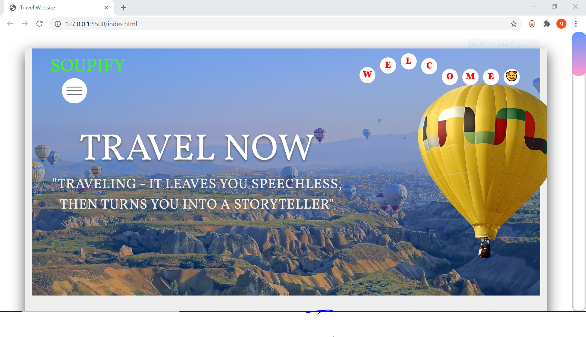
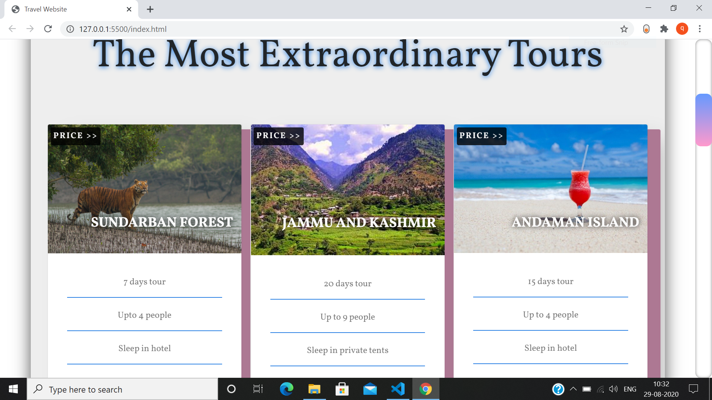
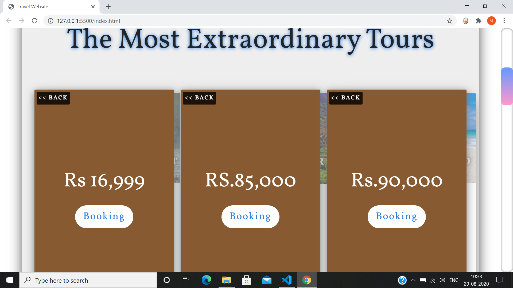
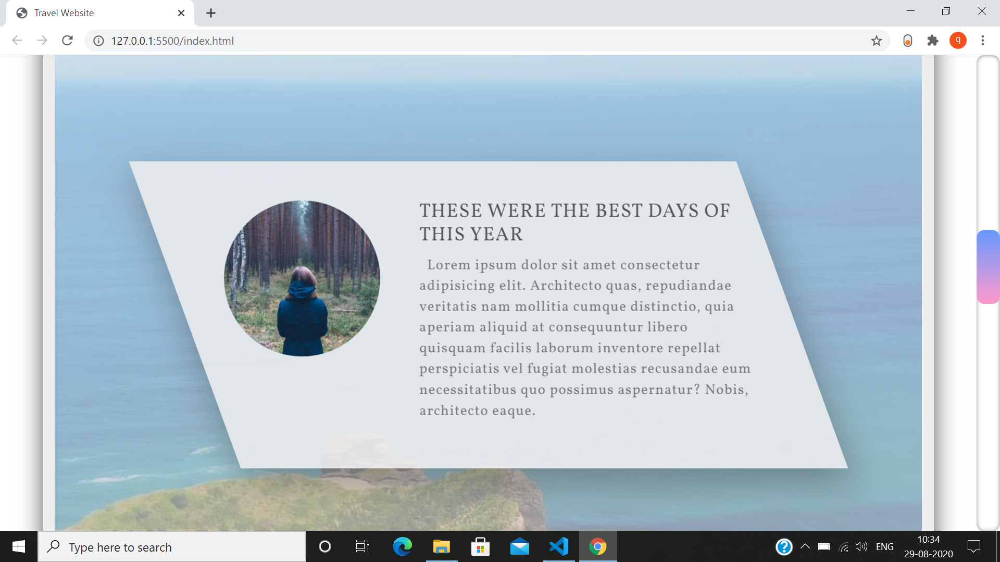
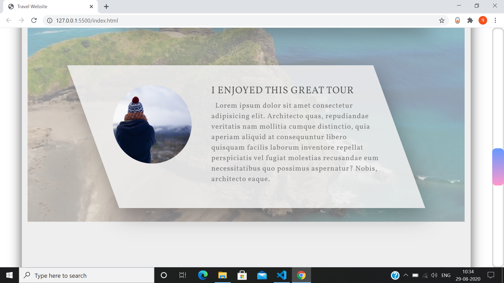
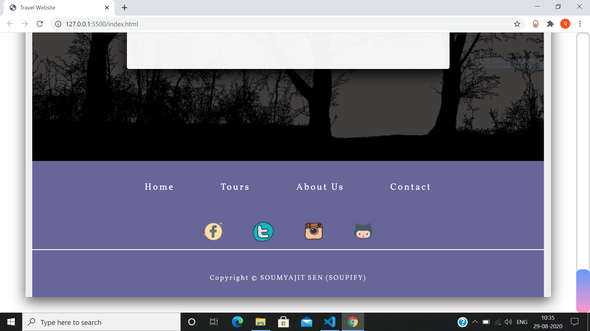
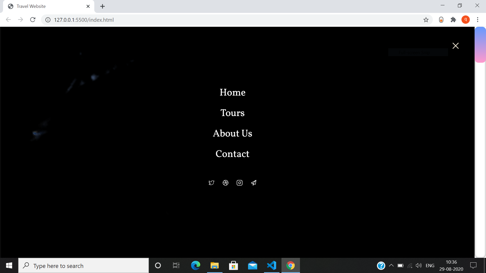

# A-TRAVEL-WEBSITE-USING-HTML-CSS-JAVASCRIPT-PHP-JQUERY

In this project I have build a Travel Website with HTML, CSS, JAVASCRIPT, PHP.

1) Header (The yellow air baloon moves)
2) Cards  (Animation in the Booking part)
3) Stories (Video Bacground)
4) Contact (color changes of the background picture)
5) Footer
6) Navbar

Screenshots of my project:

